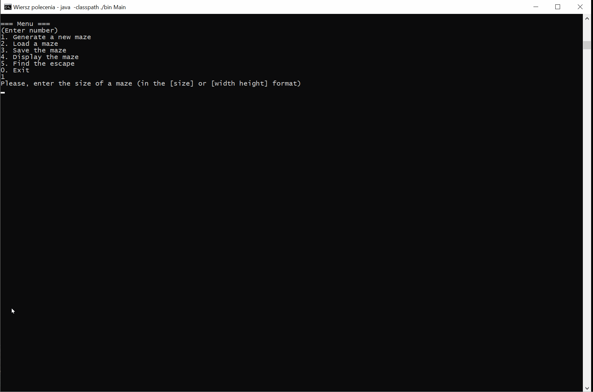

# Maze Solver

Maze Runner is a console tool for generating, solving and visualizing mazes.

To generate the maze, Kruskal's algorithm is used, with randomized weight of edges, which creates a randomized maze

To solve the maze Depth First Search algorith is used

The program is written in pure Java

## Example



## Running

It is a simple Java application and it only requires JDK 11 on your machine.

**1. Clone the application**

```bash
git clone https://github.com/malkfilipp/maze-runner.git
cd maze-runner
```

**2. Compile**

```bash
javac -sourcepath ./src -d bin src/maze/Main.java
```

**2. Run**

```bash
java -classpath ./bin maze.Main
```

**Note:** you may need to adjust the line space in order to have a continuous maze in the console.